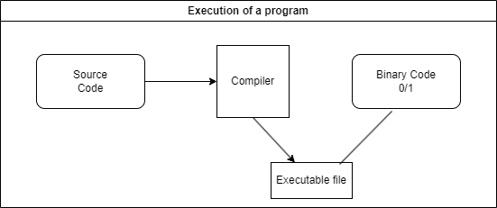

# C++ Programming

### How Does a execution of a program takes place.

### Features of compilers:

- Translation handling
- Error Handling

### What is IDE?

Integrated Development Environment: Write and execute program as per suitable and customized enviroment for that specific languages.
